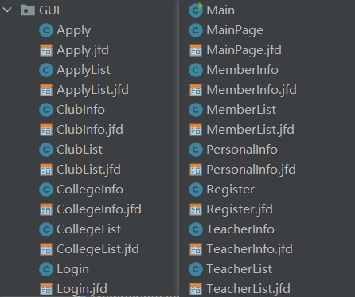

# College Student Association Management System

Just for fun！

## 实验目的

设计和实现一个数据库信息管理系统

## 实验内容

- 设计一个高校学生社团信息管理系统
- 设计内容包括需求分析、概念结构设计、逻辑结构设计、物理设计、软件的概要设计和详细设计及界面设计等。设计好的系统要求采用某种数据库及编程工具实现原型系统。

## 实验步骤

### 一、需求分析

学生社团作为各高校的重要组成部分之一，是高校学生素质拓展的重要场所，是校园文化的重要体现。而如今的高校的社团数量正随着学生的课外发展需求日益增加，从社团的组建到解散，学生从发现一个社团，到申请加入社团，再到日常管理，最后退出社团等等，这些过程都包含了许多的社团增删、社团成员管理信息、活动信息等等。尤其是随着对大学生课外拓展，第二课堂的测评工作的改革，对社团的日常管理也变得现代化和数字化。如果再使用传统的人工管理方式，数据量大，数据的管理组织零散繁杂，数据的冗余度高、共享性差，同时数据的安全性也没有保障。因此，开发一个功能较好、操作方便的高校学生社团信息管理系统对于高效规范的社团管理是极其必要的。

#### 1.1 用户需求分析

用户根据权限等级分为四个等级：

- 普通学生用户：能够随时查询和修改个人信息、申请组建新社团（申请成功后自动成为社团负责人）、申请加入/退出社团、查看社团列表信息、查看自己已加入的社团信息（包括基本信息和社团成员信息）等；
- 社团干部（不包括社团负责人）：除拥有普通学生用户的所有权限外、可以增删改查社团的部分基本信息、审核普通用户申请加入社团、对社团指导老师的简介等信息进行增删改查等；
- 社团负责人：除拥有社团干部的所有权限外，还有社团成员任免权限、申请社长职位转让、申请解散社团的权限等；
- 社团总管理员：除拥有前面三个等级的部分权限外，可以审核普通用户申请的新社团，可以审批社团社长的关于社团的转让、解散的申请，增删改查院系信息、指导教师信息等。

#### 1.2 实体/关系/功能设计分析

##### （1）用户账户与用户信息

每一个用户进入系统时首先需要登录或注册，用户注册时需要在系统内部添加用户账户信息，同时为每个用户添加个人的信息存储条目，用户登录时需要根据系统存储的用户信息进行校验，用户在登录期间可以查看和修改自己的个人信息，当用户注销账户时，系统删除相应的用户账户与用户信息。因此系统需要维护两个表，一个是**用户表**，用于存储用户的登录账号与密码等信息，方便用户登录时的校验，另一个是**用户个人信息表**，用于存储用户的个人信息，如学号、姓名、年龄等，两者通过用户名来关联。

**设计**：

①用户表：用户名，密码，权限等级等

②个人信息表：学号，姓名，年级，所属院系，用户名，性别，年龄，注册日期，手机号，微信，QQ等

其中用户表的权限等级用于标记上面得到的四类用户，分别用1~4标记，数值越高等级越高。权限等级以该用户担任的最高职务为准存在用户表中，但是对于加入的不同的社团根据相应的职务有不同的权限。

##### （2）社团信息表和社团成员表

社团列表包括所有审核通过的社团，社团信息表包含社团的一些基本信息如基本简介、创建日期、负责人等，这些基本信息可供普通用户查看，也可供社团干部修改等。社团成员表用于维护社团成员信息，如社团各成员及其担任职务等，社团成员用户可见。

**设计：**

①社团信息表：社团编号，社团名称，社团负责人（社长），指导教师，所属院系，创建时间，社团简介等

②社团成员表：社团编号，学号，姓名，职务，加入时间，退出时间，所属院系，状态等其中状态用于表示该成员是否已退出该社团。

##### （3）申请表

申请表主要分为两类（申请类型），通过设置表格的一个字段来区分，一类是普通用户的加入社团申请和退出申请，此类申请由社团干部来审批，另一类是社团负责人对职位转让、解散社团的申请以及普通用户的建团申请，此类申请由社团总管理员来审批。

##### 设计：

申请表：申请编号，申请类型，申请内容，申请人，申请时间，是否通过等

其中申请类型分为“创建”、“解散”，“转让”，“加入”，“退出”五种类型，不同类型对应不同的申请内容，当申请类型为“解散”、“加入”、“退出”时，申请内容需填写对应的社团编号，申请类型为“转让”时，申请内容需填写对应社团和转让的社团干部学号，申请类型为“创建”时，可以不填，这些逻辑都由应用程序的设计来控制实现。

##### （4）其他表格

另外还需维护一些表比如教师表、院系表等，这些表的元组记录由总管理员管理。

**设计：**

①教师表：教师编号，姓名，职称，所属院系，简介等

②院系表：学院编号，学院名称等

### 二、概念结构设计

根据需求分析，根据实体之间的关系，画出E-R图如下：


其中需求分析中的社团成员表对应学生用户和社团之间的多对多的关系，学生用户分为社团总管理员、社团负责人、社团干部、普通学生用户四类，申请表对应不同类别的学生用户之间的交互。

### 三、逻辑结构设计

按照数据库设计原理中概念结构转化成逻辑结构的规则，每个实体转换成一个关系，一对多（1:n）的联系合并到n端中，多对多(n:m、三个或三个实体以上间)的联系转换成一个关系。根据上述 E-R 图设计数据库逻辑结构，使用 SQL Server数据库，转换为以下7个关系模型（关系的码用字体加粗标出）。同时根据功能需求，为应用程序创建相应的视图接口。

#### 3.1 基本表

##### （1） 用户表Usr

①属性 

用户名Uname，用户密码Upwd，权限等级Urank。主码：用户名Uname。

②关系模式

Usr(**Uname**,Upwd,Urank)

```sqlite
CREATE TABLE Usr(
	Uname VARCHAR(20) PRIMARY KEY,
    Upwd VARCHAR(10) NOT NULL,
    Urank INTEGER
    	CONSTRAINT U1 CHECK(Urank IN(1,2,3,4))
);
```

##### （2）院系表College

①属性

学院编号Cno，学院名称Cname。主码：学院编号Cno。

②关系模式

College(Cno,Cname)

```sqlite
CREATE TABLE College(
    Cno INTEGER PRIMARY KEY,
    Cname VARCHAR(20) UNIQUE NOT NULL
);
```

被参照的完整性违约处理：更新级联更新，删除时设置Null。

##### （3）教师表Teacher

①属性

教师编号Tno，姓名Tname，职称Tjob，手机号Ttel，所属院系Tcno，简介Tintro。主码：教师编号Tno。

②关系模式

Teacher(**Tno**,Tname,Tjob,Ttel,Tcno,Tintro)

```SQLITE
CREATE TABLE Teacher(
    Tno VARCHAR(16) PRIMARY KEY,
    Tname VARCHAR(20) NOT NULL,
    Tjob VARCHAR(10)
    	CONSTRAINT T1 CHECK(Tjob IN('教授','副教授','助理教授','研究员','讲师','辅导员','其他')),
    Ttel VARCHAR(11) 
    	CONSTRAINT T2 NOT NULL,
    Tcname VARCHAR(20),
    Tintro VARCHAR(200),
);
```

被参照的完整性违约处理：更新级联更新，删除时设置Null。

##### （4）个人信息表Person

①属性

学号Pno，姓名Pname，用户名Puname，年级Pgrade，所属院系Pcname，性别Psex，年龄Page，注册日期Pdate，手机号Ptel，微信Pwechat，QQ Pqno。主码：学号Pno。

②关系模式

Person(**Pno**,Pname,Puname,Pgrade,Pcno,Psex,Page,Pdate,Ptel,Pwechat,Pqno)

```sqlite
CREATE TABLE Person(
    Pno VARCHAR(16) PRIMARY KEY,
    Pname VARCHAR(20) NOT NULL,
    Puname VARCHAR(20) NOT NULL,
    Pgrade CHAR(4),
    Pcname VARCHAR(20),
    Psex CHAR(2)
    	CONSTRAINT P1 CHECK(Psex IN('男','女')),
    Page NUMERIC(3)
    	CONSTRAINT P2 CHECK(Page>0 AND Page<=120),
    Pdate DATE
    	CONSTRAINT P3 NOT NULL,		--不用时可通过直接删除该约束条件
    Ptel VARCHAR(11)
    	CONSTRAINT P4 NOT NULL,
    Pwechat VARCHAR(20),
    Pqno VARCHAR(15),
    FOREIGN KEY (Puname) REFERENCES Usr(Uname),
    FOREIGN KEY (Pcname) REFERENCES College(Cname)
);
```

##### （5）社团信息表Organization

①属性

社团编号Ono，社团名称Oname，社团负责人Opno，指导教师Otno，所属院系Ocname，创建时间Odate，社团成员数Ocnt，社团简介Ointro。主码：社团编号Ono。

②关系模式

Organization(**Ono**,Oname,Opno,Otno,Ocname,Odate,Ocnt,Ointro)

```sqlite
CREATE TABLE Organization(
    Ono INTEGER PRIMARY KEY,
    Oname VARCHAR(20) UNIQUE,
    Opno VARCHAR(16) NOT NULL,
    Otno VARCHAR(16),
    Ocname VARCHAR(20),
    Odate DATE
    	CONSTRAINT O1 NOT NULL,
    Ocnt INTEGER
    	CONSTRAINT O2 CHECK(Ocnt>=0),
    Ointro VARCHAR(200),
    FOREIGN KEY (Opno) REFERENCES Person(Pno),
    FOREIGN KEY (Otno) REFERENCES Teacher(Tno),
    FOREIGN KEY (Ocname) REFERENCES College(Cname)
);
```

##### （6）社团成员表Member

①属性

社团编号Mono，学号Mpno，职务Mjob，加入时间Mjoin。主码：（社团编号Mono，学号Mpno）

②关系模式

Member(**Mono,Mpno**,Mjob,Mjoin)

```sqlite
CREATE TABLE Member(
    Mono INTEGER,
    Mpno VARCHAR(16),
    Mjob VARCHAR(10)
    	CONSTRAINT M1 CHECK(Mjob IN('社长','副社长','成员')),
    Mjoin DATE
    	CONSTRAINT M2 NOT NULL,
    PRIMARY KEY (Mono,Mpno),
    FOREIGN KEY (Mono) REFERENCES Organization(Ono),
    FOREIGN KEY (Mpno) REFERENCES Person(Pno)
);
```

##### （7）申请表Apply

①属性

申请编号Ano，申请类型Atype，申请内容Acont，申请人Apno，申请时间Adate，是否通过Apass。主码：申请编号Ano。

②关系模式

Apply(**Ano**,Atype,Acont,Apno,Adate,Apass)

```sqlite
CREATE TABLE Apply(
    Ano INTEGER PRIMARY KEY,
    Atype CHAR(4) NOT NULL,
    	CONSTRAINT A1 CHECK(Atype IN('创建','解散','转让','加入','退出')),
    Acont VARCHAR(20) NOT NULL,
    Apno VARCHAR(16) NOT NULL,
    Adate DATE
    	CONSTRAINT A2 NOT NULL,
    Apass NUMERIC(1)
    	CONSTRAINT A3 CHECK(Apass IN(0,1)),
    FOREIGN KEY (Apno) REFERENCES Person(Pno)
);
```

#### 3.2 视图

##### (1)社团成员信息视图

该视图包括当前社团内其他成员学号、姓名、年级、职务、所属院系、性别、联系方式。

```sqlite
CREATE VIEW MemInfo AS
SELECT Mono,Pno,Pname,Pgrade,Mjob,Mjoin,Pcname,Psex,Ptel,Pwechat,Pqno
FROM Member,Person
WHERE Member.Mpno=Person.Pno;
```

##### （2）社团成员列表视图

```sqlite
CREATE VIEW MemList AS
SELECT Mono,Pno,Pname
FROM Member,Person
WHERE Member.Mpno=Person.Pno;
```

#### 3.3 触发器

（1）在Member表上定义两个触发器，实现社团成员数自动增减

```sqlite
CREATE TRIGGER M_TG1
ON Member
AFTER INSERT
AS
BEGIN
	DECLARE @ono INTEGER
	SELECT @ono=Mono FROM inserted
	UPDATE Organization SET Ocnt=Ocnt+1 WHERE Ono=@ono;
END
```

```sqlite
CREATE TRIGGER M_TG2
ON Member
AFTER DELETE
AS
BEGIN
	DECLARE @ono INTEGER
	SELECT @ono=Mono FROM deleted
	UPDATE Organization SET Ocnt=Ocnt-1 WHERE Ono=@ono;
END
```

（2）为避免参照完整性的违约处理存在循环级联操作，因此Teacher表上的所属院系不设置为外码，而在College表上设置两个触发器，当College表存在更新和删除时同时更新Teacher表的信息。

```sqlite
CREATE TRIGGER C_TG1
ON College
AFTER UPDATE
AS
BEGIN
	DECLARE @old_cname VARCHAR(20)
	DECLARE @new_cname VARCHAR(20)
	SELECT @old_cname=Cname FROM deleted
	SELECT @new_cname=Cname FROM inserted
	UPDATE Teacher SET Tcname=@new_cname WHERE Tcname=@old_cname;
END

CREATE TRIGGER C_TG2
ON College
AFTER DELETE
AS
BEGIN
	DECLARE @cname VARCHAR(20)
	SELECT @cname=Cname FROM deleted
	UPDATE Teacher SET Tcname=null WHERE Tcname=@cname;
END
```

### 四、物理设计

本次设计主要是基于SQL Server数据库提供的物理存储环境与存取方法、以关系模型为数据模型建立的。后期可根据实际应用需求，对于数量大的关系可建立相应的索引或聚簇来提高查询效率，并为数据库实现日志和数据的备份等。

### 五、软件

#### （一）概要设计

基于`SQL Server`数据库和`Java`开发语言，利用`IntelliJ IDEA`中的`JFromDesigner`界面开发工具，设计一个具有良好交互性的专门用于高校社团人员管理的界面软件，可以满足以下交互需求：支持所有社团基本信息查看，包括社团的创建时间、简介、指导教师及其简介等信息作为普通学生了解社团的途径，支持普通用户申请创建和加入社团，支持社团成员查看社团的所有信息包括同一社团其他成员的信息等，支持社团干部（社长和其他干部）管理社团信息，其中社长可以对其他社团成员进行职务任免，支持社团的转让和解散功能（需由社长向社团总管理员申请），支持学生用户在不同社团中因担任不同职务的权限信息自动切换，支持不同的职务角色审批不同的类型的申请（即社团总管理员审批社团的创建、转让、解散的申请，社团干部可审批所管理社团的加入、退出申请），支持社团总管理员管理院系、教师信息等。

#### （二）详细设计

##### （1）数据库连接

通过`JDBC`完成数据库连接，首先需要下载相应`java`版本的数据库连接驱动，可通过[Maven Repository: com.microsoft.sqlserver » mssql-jdbc (mvnrepository.com)](https://mvnrepository.com/artifact/com.microsoft.sqlserver/mssql-jdbc)连接下载`jar`包，并在设计工程文件中添加对该驱动的外部依赖。

实验是基于`IntelliJ IDEA`的`Gradle`框架下实现的，则可以在`build.gradle`中添加以下依赖：

```json
dependencies{
	...
	implementation group: 'com.microsoft.sqlserver', name: 'mssql-jdbc', version: '9.4.0.jre8'
}
```

设计`DButil`工具类，实现对系统数据库的连接：

```java
public class DButil {
    private Connection con;
    public DButil() {
        String driver = "com.microsoft.sqlserver.jdbc.SQLServerDriver";
        String url = "jdbc:sqlserver://localhost:1433;DatabaseName=sodb;user=sa;password=123456";
        try {
            Class.forName(driver);
            con=DriverManager.getConnection(url);
        }catch(ClassNotFoundException | SQLException e) {
            e.printStackTrace();
        }
    }
    public Connection getConnection(){
        return con;
    }
}
```

##### （2）类的设计

###### ①实体类的设计


总共设计8个实体类，对应逻辑结构设计的7个实体和1个视图，分别是用户、院系、教师、个人信息、社团信息、社团成员、申请、社团成员信息视图。每个类均包括成员变量、获取和设置具体变量的值的成员函数、类的构造函数，如下所示。

```java
//Usr类
public class Usr {
	private String Uname;
    private String Upwd;
    private String Urank;
    public String getUname(){return Uname;}
    public String getUpwd(){return Upwd;}
    public String getUrank(){return Urank;}
    public void setUname(String uname) {Uname = uname;}
    public void setUpwd(String upwd) {Upwd = upwd;}
    public void setUrank(String urank) {Urank = urank;}
    public Usr()
    {
        Uname="";
        Upwd="";
        Urank="";
    }
    public Usr(String uname,String upwd,String urank)
    {
        Urank=urank;
        Uname=uname;
        Upwd=upwd;
    }
}

//College类，后面只列成员变量
public class College {
    private String Cno;
    private String Cname;
    ...
}

//Teacher类
public class Teacher {
    private String Tno;
    private String Tname;
    private String Tjob;
    private String Ttel;
    private String Tcname;
    private String Tintro;
    ...
}

//Person类
public class Person {
    private String Pno;
    private String Pname;
    private String Puname;
    private String Pgrade;
    private String Pcname;
    private String Psex;
    private String Page;
    private String Pdate;
    private String Ptel;
    private String Pwechat;
    private String Pqno;
    ...
}

//Organization类
public class Organization {
    private String Ono;
    private String Oname;
    private String Opno;
    private String Otno;
    private String Ocname;
    private String Odate;
    private String Ocnt;
    private String Ointro;
    ...
}

//Member类
public class Member {
    private String Mono;
    private String Mpno;
    private String Mjob;
    private String Mjoin;
    ...
}

//Apply类
public class Apply {
    private String Ano;
    private String Atype;
    private String Acont;
    private String Apno;
    private String Adate;
    private String Apass;
    ...
}

//MenberInfo类
public class MemberInfo {
    private String Mono;
    private String Pno;
    private String Pname;
    private String Pgrade;
    private String Mjob;
    private String Mjoin;
    private String Pcname;
    private String Psex;
    private String Ptel;
    private String Pwechat;
    private String Pqno;
    ...
}
```

###### ②操作类的设计


总共设计8个操作类，对应逻辑结构设计的7个实体和1个专门用于显示信息的类。对于每个实体对应的操作类，包含了对相应实体的数据完整性检查、数据插入、数据删除、数据更新、数据信息查询等基本操作，如以下的`ApplyDao`类；而对于`DisplayDao`类，则包含对不同实体的指定/所有元组信息的批获取，可被界面类调用从而得以显示在界面中，如下所示。

```java
//ApplyDao类
public class ApplyDao {
    //插入申请记录
    public void Apply_insert(Connection con, Apply apply) throws SQLException {
        Statement sta;
        sta=con.createStatement();
        String sql="insert into Apply values('"+apply.getAno()+"','"+apply.getAtype()+"','"+apply.getAcont()+"','"+apply.getApno()+"','"+apply.getAdate()+"','0');";
        sta.executeUpdate(sql);
    }
    //申请记录的更新，这里规定只可更新是否通过这一状态
    public void Apply_update(Connection con,String ano) throws SQLException{
        Statement sta;
        sta=con.createStatement();
        String sql="update Apply set Apass='1' where Ano='"+ano+"';";
        sta.executeUpdate(sql);
    }
    //指定申请记录的删除
    public void Apply_delete(Connection con,String ano) throws  SQLException{
        Statement sta;
        sta=con.createStatement();
        String sql="delete from Apply where Ano='"+ano+"';";
        sta.executeUpdate(sql);
    }
    //查询指定申请记录的信息
    public Apply Apply_Info(Connection con,String ano) throws SQLException {
        Statement sta;
        sta=con.createStatement();
        String sql="select * from Apply where Ano='"+ano+"';";;
        ResultSet rs = sta.executeQuery(sql);
        rs.next();
        Apply apply = new Apply(ano,rs.getString("Atype"),rs.getString("Acont"),
                rs.getString("Apno"),rs.getString("Adate"),rs.getString("Apass"));
        rs.close();
        return apply;
    }
    //返回申请记录的数目
    public String Apply_count(Connection con) throws SQLException {
        Statement sta;
        sta=con.createStatement();
        String sql = "select count(*) from Apply;";
        ResultSet rs = sta.executeQuery(sql);
        rs.next();
        String cnt = rs.getString(1);
        return cnt;
    }
}

//DisplayDao
public class DisplayDao {
    //获取所有院系的名称列表
    public List<String> CollegeList(Connection con) throws SQLException{
        List<String> list = new ArrayList<String>();
        Statement sta;
        sta=con.createStatement();
        String sql = "select Cname from College";
        ResultSet rs = sta.executeQuery(sql);
        while(rs.next()){
            String cname = rs.getString("Cname");
            list.add(cname);
        }
        rs.close();
        return list;
    }
    //获取所有社团的名称列表
    public List<String> ClubList(Connection con) throws SQLException {
        List<String> list = new ArrayList<String>();
        Statement sta;
        sta=con.createStatement();
        String sql = "select Oname from Organization";
        ResultSet rs = sta.executeQuery(sql);
        while(rs.next()){
            String oname = rs.getString("Oname");
            list.add(oname);
        }
        rs.close();
        return list;
    }
    //获取我加入的社团的名称列表
    public List<String> MyClubList(Connection con,String pno) throws SQLException {
        List<String> list = new ArrayList<String>();
        Statement sta;
        sta=con.createStatement();
        String sql = "select distinct(Oname) from Organization,MemList where MemList.Mono=Organization.Ono and MemList.Pno='"+pno+"';";
        ResultSet rs = sta.executeQuery(sql);
        while(rs.next()){
            String oname = rs.getString("Oname");
            list.add(oname);
        }
        rs.close();
        return list;
    }
    //获取所有教师的职工号、名称列表
    public List<String> TeacherList(Connection con) throws SQLException {
        List<String> list = new ArrayList<String>();
        Statement sta;
        sta=con.createStatement();
        String sql = "select Tno,Tname from Teacher";
        ResultSet rs = sta.executeQuery(sql);
        while(rs.next()){
            String info = rs.getString("Tno");
            info += ",";
            info += rs.getString("Tname");
            list.add(info);
        }
        rs.close();
        return list;
    }
    //获取可别选择的教师列表
    public List<String> TeacherSelectable(Connection con) throws SQLException {
        List<String> list = new ArrayList<String>();
        Statement sta;
        sta=con.createStatement();
        String sql = "select Tname from Teacher";
        ResultSet rs = sta.executeQuery(sql);
        while(rs.next()){
            String info = rs.getString("Tname");
            list.add(info);
        }
        rs.close();
        return list;
    }
    //获取指定社团的成员列表
    public List<String> MemberList(Connection con,String ono) throws SQLException {
        List<String> list = new ArrayList<String>();
        Statement sta;
        sta=con.createStatement();
        String sql = "select Pno,Pname from MemList";
        ResultSet rs = sta.executeQuery(sql);
        while(rs.next()){
            String info = rs.getString("Pno");
            info += ",";
            info += rs.getString("Pname");
            list.add(info);
        }
        rs.close();
        return list;
    }
    //获取指定社团的指定成员的列表
    public MemberInfo MemberInfo(Connection con,String mono,String pno) throws SQLException {
        Statement sta;
        sta=con.createStatement();
        String sql = "select * from MemInfo where Mono='"+mono+"' and Pno='"+pno+"';";
        ResultSet rs = sta.executeQuery(sql);
        rs.next();
        MemberInfo memberInfo = new MemberInfo(rs.getString("Mono"),rs.getString("Pno"),
                rs.getString("Pname"),rs.getString("Pgrade"),rs.getString("Mjob"),
                rs.getString("Mjoin"),rs.getString("Pcname"),rs.getString("Psex"),
                rs.getString("Ptel"),rs.getString("Pwechat"),rs.getString("Pqno"));
        rs.close();
        return memberInfo;
    }
    //获取管理员看到的待审批申请视图列表
    public List<String> ApplyList_Manager_View(Connection con) throws SQLException{
        List<String> list = new ArrayList<String>();
        Statement sta;
        sta=con.createStatement();
        String sql = "select * from Apply where Apass=0 AND Atype IN ('创建','转让','解散');";
        ResultSet rs = sta.executeQuery(sql);
        while(rs.next()){
            String apply = rs.getString("Ano");
            apply += ",";
            apply += rs.getString("Apno");
            apply += ",";
            apply += rs.getString("Atype");
            list.add(apply);
        }
        rs.close();
        return list;
    }
    //获取指定社团的社团干部的待审批申请视图列表
    public List<String> ApplyList_Monitor_View(Connection con,String ono) throws SQLException{
        List<String> list = new ArrayList<String>();
        Statement sta;
        sta=con.createStatement();
        String sql = "select * from Apply where Acont='"+ono+"' AND Apass=0 AND Atype IN ('加入','退出');";
        ResultSet rs = sta.executeQuery(sql);
        while(rs.next()){
            String apply = rs.getString("Ano");
            apply += ",";
            apply += rs.getString("Apno");
            apply += ",";
            apply += rs.getString("Atype");
            list.add(apply);
        }
        rs.close();
        return list;
    }
    //获取我的申请的视图列表
    public List<String> ApplyList_Personal_View(Connection con,String pno) throws SQLException{
        List<String> list = new ArrayList<String>();
        Statement sta;
        sta=con.createStatement();
        String sql = "select * from Apply where Apno='"+pno+"';";
        ResultSet rs = sta.executeQuery(sql);
        while(rs.next()){
            String apply = rs.getString("Ano");
            apply += ",";
            apply += rs.getString("Apno");
            apply += ",";
            apply += rs.getString("Atype");
            list.add(apply);
        }
        rs.close();
        return list;
    }
}
```

###### ③界面类的设计



总共设计14个界面类，分别是申请界面、申请列表界面（我的申请和待审批申请共用）、社团信息界面、我的社团列表界面、院系信息界面、院系列表界面、登录界面、主页界面、社团成员信息界面、社团成员列表、个人信息界面、账户注册界面、教师信息界面、教师列表界面。每一个界面类的设计均包含界面控件的设计、界面视图的初始化、界面按钮的事件监听、界面的视图的动态变化以及界面之间的跳转等的设计，以下面的`Mainpage`为例。

```java
public class MainPage extends JFrame {
    public MainPage(Connection connect,String rk,String uname) throws SQLException { //界面构造函数
        con = connect;	//数据库连接接口
        rank = Integer.parseInt(rk);	//用户对应的权限
        username = uname;	//用户
        route = new Stack<String>(); //从主页开始，利用栈来实现存储界面跳转的路径，方便界面在返回时根据路径返回
        setDefaultCloseOperation(DISPOSE_ON_CLOSE);	
        initComponents();	//界面控件初始化
        initView();		//界面视图初始化
        ActionListenerDemo(); //增加界面控件的事件监听
    }

    //控件的初始化，由JFormDesigner的设计自动生产，此处省略
    private void initComponents() {
        // JFormDesigner - Component initialization - DO NOT MODIFY  //GEN-BEGIN:initComponents
        titile1 = new JLabel();
        ClubList = new JScrollPane();
        organizationlist = new JList();
        loginout = new JButton();
        personalinfo = new JButton();
        title2 = new JLabel();
        college = new JButton();
        teacher = new JButton();
        create = new JButton();
        apply = new JButton();
        personalapply = new JButton();
        title3 = new JLabel();
        personalclub = new JButton();
        ...
        // JFormDesigner - End of component initialization  //GEN-END:initComponents
    }
	//界面视图初始化
    private void initView() throws SQLException {
        PersonDao personDao = new PersonDao();
        usrpno = personDao.Personid(con,username);
        String welcome="Welcome "+username;
        title3.setText(welcome);
        if(rank>1){//根据用户权限初始化不同的控件
            apply.setEnabled(true);
        }
        if(rank == 4){
            college.setEnabled(true);
            teacher.setEnabled(true);
            create.setEnabled(false);
        }
        DisplayDao displayDao = new DisplayDao();//获取社团信息列表并展示在主页中
        List<String> list = displayDao.ClubList(con);
        organizationlist.setSelectionMode(ListSelectionModel.SINGLE_SELECTION);
        ClubList.setViewportView(organizationlist);
        organizationlist.setListData(list.toArray());
    }
	//设置控件的监听事件
    private void ActionListenerDemo() throws SQLException {
        organizationlist.addListSelectionListener(new ListSelectionListener() { //监听社团列表点击事件
            @Override
            public void valueChanged(ListSelectionEvent e) {
                String club = organizationlist.getSelectedValue().toString();//获取被选中的列表项的值
                OrganizationDao organizationDao = new OrganizationDao();
                String clubid="";
                try {
                    clubid = organizationDao.Organization_id(con,club);
                } catch (SQLException throwables) {
                    throwables.printStackTrace();
                }
                //跳转到被选中的社团的信息页
                route.push("MainPage");//压入跳转路径
                try {
                    ClubInfo clubInfo = new ClubInfo(con,rank,username,usrpno,clubid,route);
                    clubInfo.setVisible(true);
                } catch (SQLException throwables) {
                    throwables.printStackTrace();
                }
                dispose();
            }
        });
        personalinfo.addActionListener(new ActionListener() {	//“我的信息”按钮点击事件监听
            @Override
            public void actionPerformed(ActionEvent e) {
                //跳转到个人信息界面
                route.push("MainPage");
                try {
                    PersonalInfo personalInfo = new PersonalInfo(con,rank,username,usrpno);
                    personalInfo.setVisible(true);
                } catch (SQLException throwables) {
                    throwables.printStackTrace();
                }
                dispose();
            }
        });
        personalapply.addActionListener(new ActionListener() {	//“我的申请”按钮点击事件监听
            @Override
            public void actionPerformed(ActionEvent e) {
                //跳转到申请列表页面
                route.push("MainPage");
                try {
                    ApplyList applyList = new ApplyList(con,rank,username,usrpno,"查看",route);
                    applyList.setVisible(true);
                } catch (SQLException throwables) {
                    throwables.printStackTrace();
                }
                dispose();
            }
        });
        personalclub.addActionListener(new ActionListener() {	//“我的社团”按钮点击事件监听
            @Override
            public void actionPerformed(ActionEvent e) {
                //跳转到个人加入的社团界面
                route.push("MainPage");
                try {
                    ClubList clubList = new ClubList(con,rank,username,usrpno,route);
                    clubList.setVisible(true);
                } catch (SQLException throwables) {
                    throwables.printStackTrace();
                }
                dispose();
            }
        });
        college.addActionListener(new ActionListener() {	//“院系信息”按钮事件监听
            @Override
            public void actionPerformed(ActionEvent e) {
                //跳转到院系列表界面
                route.push("MainPage");
                try {
                    CollegeList collegeList = new CollegeList(con,rank,username,usrpno,route);
                    collegeList.setVisible(true);
                } catch (SQLException throwables) {
                    throwables.printStackTrace();
                }
                dispose();
            }
        });
        teacher.addActionListener(new ActionListener() {	//“教师信息”按钮事件监听
            @Override
            public void actionPerformed(ActionEvent e) {
                //跳转到教师列表界面
                route.push("MainPage");
                try {
                    TeacherList teacherList = new TeacherList(con,rank,username,usrpno,route);
                    teacherList.setVisible(true);
                } catch (SQLException throwables) {
                    throwables.printStackTrace();
                }
                dispose();
            }
        });
        create.addActionListener(new ActionListener() {	//“创建新社团”按钮事件监听
            @Override
            public void actionPerformed(ActionEvent e) {
                Date currentTime = new Date();
                SimpleDateFormat formatter = new SimpleDateFormat("yyyy-MM-dd");
                String date = formatter.format(currentTime);
                com.entity.Apply apply = new Apply("","创建","",usrpno,date,"0"); //生成创建申请的基本信息
                //跳转到创建社团申请界面，传递个人学号信息
                route.push("MainPage");
                try {
                    com.GUI.Apply apply1 = new com.GUI.Apply(con,rank,username,usrpno,"创建",apply,route);
                    apply1.setVisible(true);
                } catch (SQLException throwables) {
                    throwables.printStackTrace();
                }
                dispose();
            }
        });
        loginout.addActionListener(new ActionListener() { //“退出登录”按钮事件监听
            @Override
            public void actionPerformed(ActionEvent e) {
                //退出登录
                int input = JOptionPane.showConfirmDialog(loginout,"Are you sure to loginout?","submit notice",1,2);//弹窗确认操作
                if(input == 0){
                    com.GUI.Login login = new Login();
                    login.setVisible(true);
                    dispose();
                }
            }
        });
        apply.addActionListener(new ActionListener() { //“审批申请”按钮事件监听
            @Override
            public void actionPerformed(ActionEvent e) {
                //跳转到待审批申请列表界面
                route.push("MainPage");
                try {
                    ApplyList applyList = new ApplyList(con,rank,username,usrpno,"审批",route);
                    applyList.setVisible(true);
                } catch (SQLException throwables) {
                    throwables.printStackTrace();
                }
                dispose();
            }
        });
    }
    // JFormDesigner - Variables declaration - DO NOT MODIFY  //GEN-BEGIN:variables
    private JLabel titile1;
    private JScrollPane ClubList;
    private JList organizationlist;
    private JButton loginout;
    private JButton personalinfo;
    private JLabel title2;
    private JButton college;
    private JButton teacher;
    private JButton create;
    private JButton apply;
    private JButton personalapply;
    private JLabel title3;
    private JButton personalclub;
    // JFormDesigner - End of variables declaration  //GEN-END:variables
    private int rank;
    private String username;
    private String usrpno;
    private Connection con;
    private Stack<String> route;
}
```

#### （三）界面设计

##### （1）登录界面

登录界面用于用户的登录。登录界面包括提示label、用户名、密码的输入框和登录、注册、退出三个按钮，用户通过输入用户名和密码进行登录，如果没有账号，可以点击注册按钮跳转到注册界面进行账号注册。


##### （2）注册界面

注册界面用于用户账号的注册。注册界面包括用户名、密码、确认密码、用户姓名、学号、联系方式等必要信息的填写，在点击注册时会对每个填写框的填写内容进行合法性检测（避免由于不合法的数据插入导致操作失败），并以弹窗的方式进行警告或提示。每个学生用户注册时其权限等级自动初始化为普通用户，注册完成后直接跳转到主页面。


##### （3）主页面

主页面相当于一个主菜单，满足不同用户的查看信息、创建或加入社团等需求。主页面包括一个社团列表视图，该社团列表会展示当前数据库中存储的所有社团的名称，点击任意一个社团可以跳转到相应的社团信息界面，此外个人信息、我的社团、我的申请、院系信息、教师信息、审批信息、创建社团、退出登录共8个按钮，对于不同权限等级的用户，其可用的按钮是不同的，点击不同按钮可跳转到相应的界面。

**①总管理员主页面**


**②社团干部主页面**


##### ③普通学生用户视图


##### （4）个人信息界面

个人信息用于用户查看和编辑个人信息。个人信息界面包括用户名、学号、姓名、年级、院系等基本信息的展示，可通过“编辑”和“提交”两个按钮对个人信息进行更新。


##### （5）院系列表界面

院系列表用于总管理员选择相应需要查看或新增院系信息。院系列表只能为总管理员可见，该界面包括一个院系列表视图和“新增”、“返回”两个按钮，列表会展示当前数据库中存储的所有院系的信息，点击列表中的一项或“新增”按钮均可以跳转至院系信息界面，从而查看更新或者新增院系信息，“返回”则直接返回主页面。


##### （6）院系信息界面

院系信息用于总管理员查看、编辑、新增院系信息。院系信息同样只为总管理员所见，该界面包括院系的编号、名称和“删除”、“编辑”、“提交”、“返回”四个按钮。对于已经存在的院系信息（查看模式），则可以更新或删除其信息；对于新增院系信息（新增模式），可以编辑文本输入框内容然后提交，提交后进入查看模式，可编辑或删除院系信息。


##### （7）教师列表界面

教师列表用于总管理员选择相应需要查看或新增教师信息。教师列表只能为总管理员可见，该界面包括一个教师列表视图和“新增”、“返回”两个按钮，列表会展示当前数据库中存储的所有教师的信息，点击列表中的一项或“新增”按钮均可以跳转至教师信息界面，从而查看更新或者新增教师信息，“返回”则直接返回主页面。


##### （8）教师信息界面

教师信息用于总管理员查看、编辑、新增院系信息，用于所有用户通过查看社团指导教师信息、用于社团干部编辑相应社团指导教师的部分信息。该界面包括教师的编号、名称、所属院系、简介等信息和“删除”、“编辑”、“提交”、“返回”四个按钮。对于总管理员，拥有如院系信息界面一般的查看、删除、新增、更改功能，对于社团干部，可编辑相应指导教师的简介、所属院系等信息。点击“返回”则根据相应的界面跳转路径返回相应的上一个界面。


##### （9）社团列表界面

社团列表界面主要用于不同用户查看自己已经加入的社团列表信息。该界面主要包含一个列表和一个“返回”按钮，用于展示当前用户已经加入的社团列表，选中其中一项可以跳转到相应的社团信息界面，点击“返回”则直接返回主页面。


##### （10）社团信息界面

社团信息界面用于展示指定的社团的基本信息。该界面包括社团编号、社团名称、社团创建时间、社团负责人、所属院系、指导老师、社团简介等信息的展示，包括了可供社团负责人申请解散、转让的按钮，可供社团干部编辑当前社团信息的编辑、提交按钮，可供社团外普通用户申请加入的按钮，可供社团成员用户申请退出的按钮；若指导老师不为空，所有用户均可通过“老师信息”按钮查看指导教师的基本信息，社团成员可通过“社团成员”按钮查看社团成员信息。点击“返回”则根据界面跳转路径返回上一个界面。此外，当用户进入该界面时，会根据该用户在当前社团中担任的职务来改变用户的权限，由此实现同一用户查看不同社团时拥有不同的权限，并在接下来的界面跳转时实现权限的灵活处理。


##### （11）社团成员列表界面

社团成员列表用于展示指定社团的成员列表。社团成员列表界面仅为社团成员可见。该界面主要包含一个列表和一个“返回”按钮，用于展示当前指定社团的成员列表，选中其中一项可以跳转到相应成员的信息界面，点击“返回”则直接返回社团信息界面。


##### （12）社团成员信息界面

社团成员信息界面用于展示指定社团、指定成员的信息。该界面包括社团成员的姓名、联系方式、担任职务等基本信息，社团负责人可以通过此界面的“编辑”、“提交”按钮对其他社团成员进行职务任免，任免时同时更新相应成员的权限。点击“返回”则直接返回社团成员列表界面。


##### （13）申请列表界面

申请列表界面用于普通用户查看“我的申请”列表、管理员和社团干部审批“待审批申请”的列表。该界面包含一个列表和一个“返回”按钮，对于所有用户，用于展示我的申请列表，对于社团干部和管理员，还可用于待审批的申请列表的展示，选中其中一项可以跳转到相应申请记录的信息界面。点击“返回”则直接返回主页面。

**①我的申请界面**


**②待审批申请界面**


##### （14）申请信息界面

申请界面用于用户的申请提交、查看和管理员或社团干部审批申请。该界面包含一个申请记录的申请编号、申请类型、申请内容、申请人、申请时间和申请状态等信息，以及”审批申请“、”提交“、”返回“三个按钮。跳转到该界面之前，会根据不同的用户权限、访问模式和申请类型传递相应的初始化信息，对于需提交的部分申请（转让和创建），除了申请内容可编辑外其他信息由系统自动生成，用户只需要根据提示输入内容后提交即可，提交完成后进入”查看“模式 。点击“返回”则返回申请列表界面。

**①5种不同类型的申请提交界面。**


**②审批申请界面**


**③申请信息查看界面**


## 实验总结

本次大作业由于是个人单独完成，因此从构思到设计再到实现整个过程的工作量还是蛮大的，尤其是在不熟悉`Java GUI`开发的情况下。总体上通过本次实验让我更加熟悉了如何设计和使用数据库，包括数据库的设计过程、设计过程中数据库和应用程序之间的模式对接、设计过程中关于视图、触发器、约束条件等细节性的设计，同时进一步了解了界面软件的开发设计和实现流程。

总结来说，该高校社团信息管理系统还有很多不足的地方，其功能还有许多可以拓展和完善的地方。思路如下：

①社团活动作为社团宣传的重要途径之一，可以对该数据库加入活动记录信息表，存储不同社团的活动信息并可以在软件界面中展示。

②支持联网功能，将数据库部署到云端。

③软件设计：支持修改密码、找回密码（如短信验证）、注销账户等用户账户管理功能，支持申请撤回等社团管理功能。
